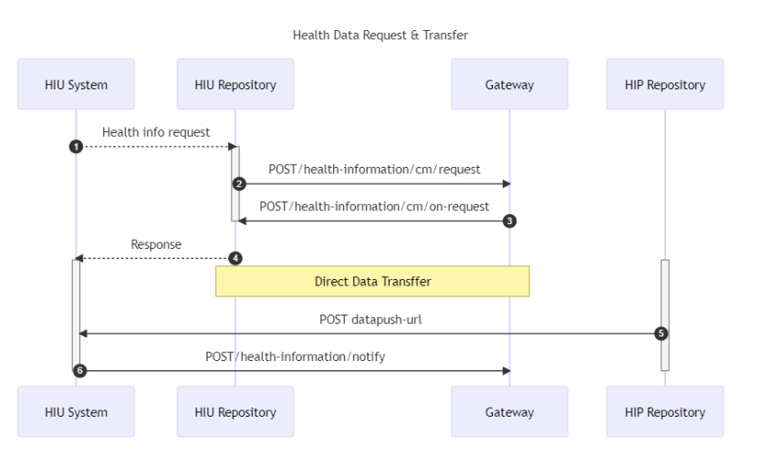

# ABDM Data Transfer and Workflow.
ABDM (Ayushman Bharat Digital Mission) is a pioneering initiative undertaken by the Government of India to establish a robust digital health infrastructure that supports an integrated healthcare ecosystem. This mission aims to bridge existing gaps among various stakeholders in the healthcare sector by establishing digital highways, enabling seamless connectivity and efficient information exchange.

## Data Transfer Workflow 
Allow consented medical data transfer to the ABDM network between HIU(Health Information User) and HIP (Health Information Provider)

- Handling encryption decryption.

- Developing APIs for receiving health data requests and  provide health records.

Objectives of the project are to:

- Optimize  data transfer between the HIU and HIP, resulting in a more efficient and streamlined system.

- Capabilities of both async and sync apis. Developers will have the option to opt according to their convenience.

- Handling encryption decryption.

- Developing APIs for receiving health data requests and  provide health records.

## How to Setup the Project

For setting up this repository, please follow the following steps:

Clone this repo.

1.Set up a gradle project in your system.

2,In the DiscoveryApplication file, run the application for the localhost at port 9090 to start running.

3.In your postman, test the following APIs (POST calls) after putting the authorization token in your bearer token column.

4.Hit send request, to test the API and get "202 Accepted" response for it to correctly work.

## Regarding Encryption and decryption

1.Go to this repo clone it in your local dev env do the necessary steps.

<a href ="https://github.com/sukreet/fidelius/tree/84bc68c8a80d91a665dd88b05e5757a09a2d663a"> Encryption and Decryption Engine  </a>

2.Hit the key generation api it will generate the keys and nonce 

3.Use that generated key in Request body of HrpApi.

## Data Transfer Workflow

## Project Structure

The gateway api which are required for Health Data Request are Implemented.

Webhook is used for this project.

You can find more about gateway  api   here.

<a href="https://sandbox.abdm.gov.in/swagger/ndhm-gateway.yaml"> Click here to know more about gateway api </a>

1.Controller

 - The Controller section has Hrpcontroller in which all the api controller is implemented.

2.Model 

- In this Section all the initial structure for the request body of particular api is implemented.
  
- Iniital nested classes are createdd.
- The strcture for callback api such as cm-on and hip-on is created which act as a acknowledgement for the Hrp and Hip api.
  
  Note: The gateway controller for callback api is not implemented the model structure is created.
  

3.Testing.

- The test directory has some dummy test this can be used for setting some assertions to test diff component working correctly or not using Mockito.
- Unit testing for the Hrp Request is implemented.

4.Postman testing 

 - For Authorization use  Bearer access token create it using session api.

 - In Hrprequest controller class paste the access token and then run the project otherwise u will get an unauthorized error.

 - For X-CM-ID, use "sbx".

