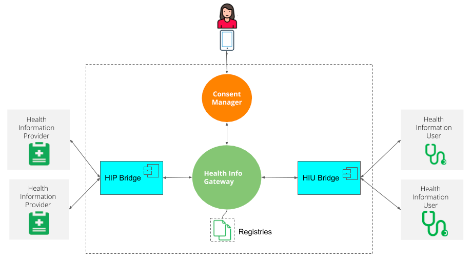
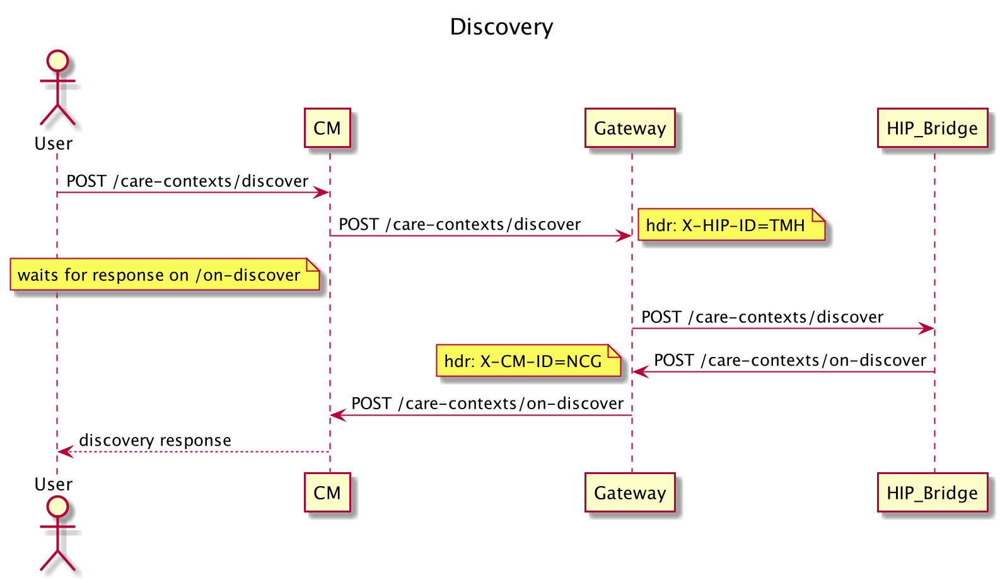
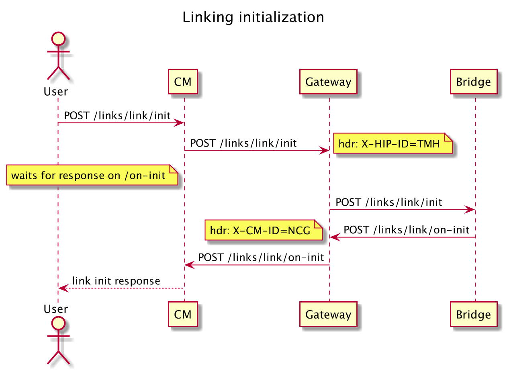
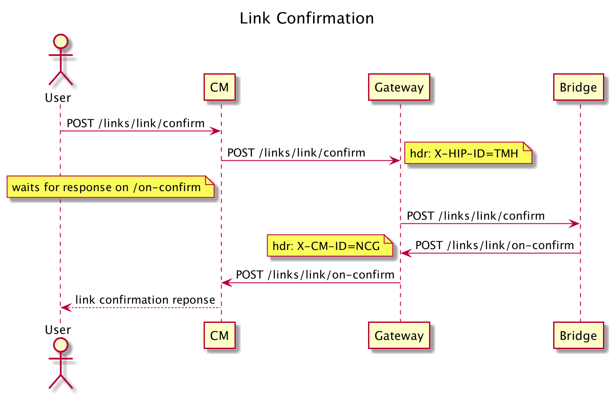

# ABDM Discovery and Linking

ABDM (Ayushman Bharat Digital Mission) is a pioneering initiative undertaken by the Government of India to establish a robust digital health infrastructure that supports an integrated healthcare ecosystem. This mission aims to bridge existing gaps among various stakeholders in the healthcare sector by establishing digital highways, enabling seamless connectivity and efficient information exchange.

As part of the Code for GovTech 2023 program, in my project “Discovery and Linking Workflows”, the primary objective is to ensure that patients are easily discoverable within the ABDM ecosystem using their unique ABHA number (Ayushman Bharat Health ID). This unique identifier acts as a key to unlock access to a patient's comprehensive health information.

The entire project can be broken down into these 9 main tasks to be completed in 8 weeks with each task having further sub-tasks to ensure the proper completion of the project:

1. Understanding the domain of the project
2. Understanding the problem statement
3. Understanding the goals and scopes of this project
4. Setting up the Sandbox environment
5. Setting up a local dev environment
6. Define API contracts
7. Develop the required APIs to simplify discovery and linking workflows
8. Comprehensive Testing of the APIs
9. Documentation

This project aims to establish a network of connected healthcare systems to improve continuity of care and deliver better quality of care. It will also enable the exchange of patient care information between members of the network for better treatment management, while ensuring patient privacy and confidentiality. Additionally, it will leverage a tiered approach to care delivery.

The specific objectives of the project are to:

- Establish standards and protocols for the discovery, linking, and exchange of patient health information with the consent of authorized users (practitioners, patients, and providers).
- Ensure patient privacy and confidentiality throughout the information request, consent, and data flow process.
- Develop a set of reference components that can be used to create ready-to-use solutions.
- Design and develop solutions in collaboration with established healthcare providers to meet the needs of practitioners, users, and patients.
- Identify challenges and develop solutions that can be adopted at scale.

The source code for ABDM Discovery and Linking project is available on [GitHub](https://github.com/atulai-sg/abdm-wrapper).

## Setting up

For setting up this repository, please follow the following steps:
1. Clone this repo.
2. Set up a gradle project in your system.
3. In the DiscoveryApplication file, run the application for the localhost at port 9090 to start running. 
4. In your postman, test the following APIs (POST calls) after putting the authorization token in your bearer token column.
5. Hit send request, to test the API and get "202 Accepted" response for it to correctly work. 

## Components 

There are 4 essential components of as elaborated in this project. Three are representative of entities that are involved:

1. Patient themselves 
2. Healthcare Services who act as Information Providers 
3. Users of the health information (practitioners, payers, etc) and 
4. A fiduciary/trustee that facilitates the discovery, linking of patient within the network and consented means of exchange of patient’s health information.

## Gateway APIs Documentation
Gateway is the hub that routes/orchestrates the interaction between consent managers and API bridges. There are 5 categories of APIs; discovery, link, consent flow, data flow and  monitoring. 

### Discovery paths:
1. /v0.5/care-contexts/discover:

   - summary: Discover patient's accounts
   - description: >
   Request for patient care context discover, made by CM for a specific HIP. It is expected that HIP will subsequently return either zero or one patient record with (potentially masked) associated care contexts
   1. **At least one of the verified identifier matches**
   2. **Name (fuzzy), gender matches**
   3. **If YoB was given, age band(+-2) matches**
   4. **If unverified identifiers were given, one of them matches**
   5. **If more than one patient records would be found after aforementioned steps, then patient who matches most verified and unverified identifiers would be returned.**
   6. **If there would be still more than one patients (after ranking) error would be returned**
   7. **Intended HIP should be able to resolve and identify results returned in the subsequent link confirmation request via the specified transactionId**
   8. **Intended HIP should store the discovery results with transactionId and care contexts discovered for subsequent link initiation**

   
2. /v0.5/care-contexts/on-discover:

- summary: Response to patient's account discovery request
- description: >
   Result of patient care-context discovery request at HIP end. If a matching patient found with zero or more care contexts associated, it is specified as result attribute. If the prior discovery request, resulted in errors then it is specified in the error attribute. Reasons of errors can be
   1. **more than one definitive match for the given request**
   2. **no verified identifer was specified**

### Linking paths:

3. /v0.5/links/link/init:

- summary: Link patient's care contexts
- description: >
    Request from CM to links care contexts associated with only one patient
    1. **Validate account reference number and care context reference number**
    2. **Validate transactionId in the request with discovery request entry to check whether there was a discovery
    and were these care contexts discovered or not for a given patient**
    3. **Before eventual link confirmation, HIP needs to authenticate the request with the patient(eg: OTP verification)**
    4. **HIP should communicate the mode of authentication of a successful request to Consent Manager**
    
4. /v0.5/links/link/on-init:

- summary: Response to patient's care context link request
- description: >
    Result of patient care-context link request from HIP end. This happens in context of previous discovery of patient found at HIP end, therefore the link requests ought to be in reference to the patient reference and care-context references previously returned by the HIP. The correlation of discovery and link request is maintained through the transactionId. HIP should have
    1. **Validated transactionId in the request to check whether there was a discovery done previously, and the link request corresponds to returned patient care care context references**
    2. **Before returning the response, HIP should have sent an authentication request to the patient(eg: OTP verification)**
    3. **HIP should communicate the mode of authentication of a successful request**
    4. **HIP subsequently should expect the token passed via /link/confirm against the link.referenceNumber passed in this call**

        The error section in the body, represents the potential errors that may have occurred. Possible reasons:
          1. **Patient reference number is invalid**
          2. **Care context reference numbers are invalid**

5. /v0.5/links/link/confirm:

- summary: Token submission by Consent Manager for link confirmation
- description: >
    API to submit the token that was sent by HIP during the link request.
    
6. /v0.5/links/link/on-confirm:
    
- summary: Token authenticated by HIP, indicating completion of linkage of care-contexts
- description: >
    Returns a list of linked care contexts with patient reference number.
    1. **Validated and linked account reference number**
    2. **Validated that the token sent from Consent Manager is same as the one generated by HIP**
    3. **Verified that same Consent Manager which made the link request is sending the token**
    4. **Results of unmasked linked care contexts with patient reference number**
    
7. /v0.5/links/link/add-contexts:

- summary: API for HIP initiated care-context linking for patient
- description: >
    API to submit care-context to CM for HIP initiated linking. The API must accompany the "accessToken" fetched in the users/auth process.  
  - subsequent usage for accessToken may be invalid if it was meant for one-time usage or if it expired

8. /v0.5/links/link/on-add-contexts:
    
- summary: callback API for HIP initiated patient linking /link/add-context
- description: >
    If the accessToken is valid for purpose of linking, and specified details provided, CM will send "acknoweldgement.status" as SUCCESS. If any error occcurred, for example invalid token, or other required patient or care-context information not provided, then "error" attribute conveys so.
   
9. /v0.5/links/context/notify:

- summary: This API is meant to be called by HIPs when there is new health data generated for a patient, against a care context that is already linked to patient's NDHM account.
- description: >
    This API is called by HIP only when there is new health data is added/created for a patient and under a care context that is already linked with patient's Health Account.
    HIP can send following things in this API to notify the Consent Manager about the new health data added:
    1. **Patient's Identifier for which the new health data is added (It can be NDHM id or NDHM number)**
    2. **Care Context reference under which the new health data is added**
    3. **Patient's reference (An identifier with which the patient is registered on HIP)**
    4. **Types of health information documents that have been added**
    5. **A date when the health information was created/added on the HIP**

        Note: This API shouldn't be called if the new heath data of is added/created under new care context. 

10. /v0.5/links/context/on-notify:

- summary: Acknowledgement sent by Consent Manager to HIP for data notification.
- description: >
    CM sends back acknowledgement of receiving data notification by HIPs. CM may return errors if in following scenarios:
    1. **Patient id sent by HIP in the data notification is incorrect**
    2. **Carecontext sent by HIP in the data notification is not linked or incorrect.**

### Flow Sequence Diagrams 
1. Discovery 

**For X-CM-ID, use "sbx".**

2. Linking

**For X-CM-ID, use "sbx".**

# ABDM Data Transfer and Workflow.
ABDM (Ayushman Bharat Digital Mission) is a pioneering initiative undertaken by the Government of India to establish a robust digital health infrastructure that supports an integrated healthcare ecosystem. This mission aims to bridge existing gaps among various stakeholders in the healthcare sector by establishing digital highways, enabling seamless connectivity and efficient information exchange.

## Data Transfer Workflow 
Allow consented medical data transfer to the ABDM network between HIU(Health Information User) and HIP (Health Information Provider)

- Handling encryption decryption.

- Developing APIs for receiving health data requests and  provide health records.

Objectives of the project are to:

- Optimize  data transfer between the HIU and HIP, resulting in a more efficient and streamlined system.

- Capabilities of both async and sync apis. Developers will have the option to opt according to their convenience.

- Handling encryption decryption.

- Developing APIs for receiving health data requests and  provide health records.

## How to Setup the Project

For setting up this repository, please follow the following steps:

Clone this repo.

1.Set up a gradle project in your system.

2,In the DiscoveryApplication file, run the application for the localhost at port 9090 to start running.

3.In your postman, test the following APIs (POST calls) after putting the authorization token in your bearer token column.

4.Hit send request, to test the API and get "202 Accepted" response for it to correctly work.

## Regarding Encryption and decryption

1.Go to this repo clone it in your local dev env do the necessary steps.

<a href ="https://github.com/sukreet/fidelius/tree/84bc68c8a80d91a665dd88b05e5757a09a2d663a"> Encryption and Decryption Engine  </a>

2.Hit the key generation api it will generate the keys and nonce 

3.Use that generated key in Request body of HrpApi.

## Data Transfer Workflow

## Project Structure

The gateway api which are required for Health Data Request are Implemented.

Webhook is used for this project.

You can find more about gateway  api   here.

<a href="https://sandbox.abdm.gov.in/swagger/ndhm-gateway.yaml"> Click here to know more about gateway api </a>

1.Controller

 - The Controller section has Hrpcontroller in which all the api controller is implemented.

2.Model 

- In this Section all the initial structure for the request body of particular api is implemented.
  
- Iniital nested classes are createdd.
- The strcture for callback api such as cm-on and hip-on is created which act as a acknowledgement for the Hrp and Hip api.
  
  Note: The gateway controller for callback api is not implemented the model structure is created.
  

3.Testing.

- The test directory has some dummy test this can be used for setting some assertions to test diff component working correctly or not using Mockito.
- Unit testing for the Hrp Request is implemented.

4.Postman testing 

 - For Authorization use  Bearer access token create it using session api.

 - In Hrprequest controller class paste the access token and then run the project otherwise u will get an unauthorized error.

 - For X-CM-ID, use "sbx".

